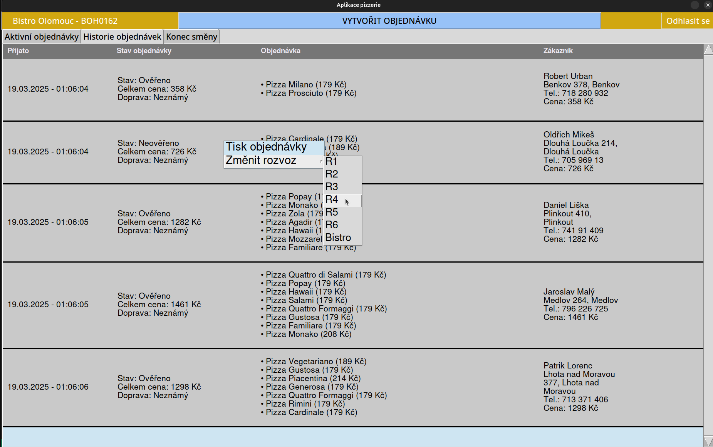

# vsb_uro_projects
Repository for frontend projects in tkinter, C++ and Bootstrap

# Order Management System

## Overview
The Order Management System is a Tkinter-based GUI application designed to manage and process customer orders efficiently. The system provides features for order tracking, verification, and finalization while ensuring an intuitive user experience through a structured interface with scrollable frames and dynamic updates.

## Features

### Order Processing
- Displays active and historical orders with details including order date, status, total price, delivery method, and customer information.
- Allows orders to be verified, finalized, or canceled.
- Supports dynamic ordering, ensuring that unverified orders appear at the top.

### Dynamic UI
- Utilizes Tkinter frames and canvases for structured display.
- Implements a scrollable interface for handling a large number of orders.
- Updates the interface dynamically when an order is modified or removed.
- Provides right-click context menus for quick access to actions.

### Delivery Management
- Enables assigning delivery methods (e.g., R1-R6, Bistro) to orders.
- Tracks delivery financials, including total revenue and earnings per delivery method.
- Allows modification of delivery assignments after initial selection.

### Context Menus
- Right-clicking on an order in History tab opens a menu with options to print the order or change the delivery method.
- Submenus provide delivery selection options that update order status upon selection.

### Scrollbar & Navigation
- Implements a vertical scrollbar for managing extensive order lists.
- Scrollbars adjust dynamically when orders are added or removed.
- Mousewheel support for smoother navigation.

### Financial Tracking
- Displays financial summaries including:
  - Total revenue
  - Breakdown of payments by delivery type
  - Cash management for shift end processing
- Prevents negative values by dynamically updating displayed financials.

### Shift End Processing
- Provides a structured form for recording financials at the end of a shift.
- Allows entry of payment breakdowns, expenses, and cash deferments.
- Implements validation logic to ensure accurate financial reporting.

### Data Storage & Retrieval
- Reads and writes order data to a JSON file.
- Ensures seamless persistence of order details across application sessions.
- Updates the JSON file dynamically when orders are verified, finalized, or canceled.

### Error Handling & Validation
- Ensures financial calculations remain accurate.
- Highlights incorrect entries in red for user correction.
- Prevents invalid delivery assignments and duplicate orders.

## Technologies Used
- **Python**: Core programming language.
- **Tkinter**: GUI framework for UI design.
- **JSON**: Data storage and retrieval.

## Usage Instructions
1. Launch the application and press button Make Order a few times.
2. Navigate between **Active Orders** and **Order History** tabs.
3. Right-click an order to print or change the delivery assignment.
4. Click **Finish Order** to complete an order and assign delivery.
5. On end shift tab Click **Count** to validate shift-end financials.
6. Afterwards Click **Save** to finalize shift-end records and save them.

# Pictures

